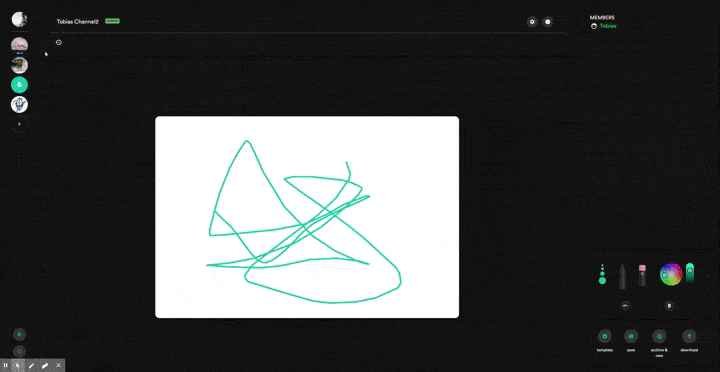

# Projekt

Die Anwendung soll eine Plattform für kollaboratives Zeichnen mit mehreren Benutzern bieten. Der Fokus liegt dabei auf dem Zusammenschluss in Gruppen (Channels), die eine Zeichenfläche zur Verfügung gestellt bekommen, mit der sie gemeinsam an einem Sketch arbeiten können. Die so erstellten Zeichnungen können abgeschlossen und wenn gewünscht veröffentlicht werden. Im "Public Feed" werden diese dann, zusammen mit Bildern anderer Kanäle, allen angemeldeten und anonymen Besuchern angezeigt und können von ersteren mit "Gefällt mir" oder "Gefällt mir nicht" ausgezeichnet werden. 

## Team

1. [Tim Eichinger](https://github.com/eichingertim) - tim1.eichinger@stud.uni-regensburg.de
  * Komponenten: 
    * Websocket 
    * Zeichenkomponente+Toolbox
    * Dashboard Frontend
    * Sketch-History
    * Sketch-Export und Vorlagen Import
2. [Tobias Dollhofer](https://github.com/tobiasdollhofer) - tobias.dollhofer@stud.uni-regensburg.de
  * Komponenten: 
    * Sketchfunktionalität Backend (Datenbankmodel, Upload) 
    * Publicfeed
    * Web- und Datenbankhosting
    * Logo-Design
    * Impressum
3. [Lukas Schauhuber](https://github.com/luggaesch) - lukas.schauhuber@stud.uni-regensburg.de
  * Komponenten: 
    * Backendrouting und Express-Konfiguration
    * Datenbank, Modelle User und Channel
    * Authentifizierung
    * Channelsystem
    * Frontend Landing- und PublicFeed
    * View Engine
    * Dateiupload
    * Domainregistrierung
    * Webserverhosting
4. [Timon Lorenz](https://github.com/TimmensOne) - timon.lorenz@stud.uni-regensburg.de
  * Komponenten:
    * Design Adminsettings Dialog
    * Design Userprofile Dialog
    * Landingpage Anordnung und Texte

## Setup und Ausführen der Anwendung

Die App wird vom Projektteam unter der Domain https://www.sketchimp.me angeboten.
Zusätzlich besteht die Möglichkeit, das Projekt direkt auf einem eigenen Webserver auszuführen.
Allerdings ist zu beachten, dass, ohne Anpassung der Datenbank-Verbindung, die Bild-Referenzen nicht geladen werden können, da die Quelldateien nur auf dem gehosteten Webserver vorliegen. Die reguläre Datenbank-URL liegt unter `/lib/config/Constants.js` als Konstante vor.

Um die Anwendung lokal zu installieren und zu starten sind keine besonderen Schritte notwendig. 
Es reichen folgende Kommandos:

```npm install```

```npm start```

## Beschreibung

|   |   |   |
|---|---|---|
| Registrieren von Nutzern  | Anmeldung im System  | Erstellen von Channels  |
|   |   |   |
| Betreten von Channels  | Zeichnen auf eigenem peristentem Canvas pro Channel  | Festlegen von Benutzerrollen mit verschiedenen Rechten pro Channel  |
|   |   |   |
| Verwendung eines Ebenensystems  | Wechseln von Stiftgrößen, Farben; Radieren, Rückgängig machen, Löschen  | Ändern von Usereinstellungen, Hochladen eines Avatars  |
|   |   |   |
| Hochladen eines Channel Avatars  | Abschließen von Zeichnungen  | Veröffentlichen von Zeichnungen  |
|   |   |   |
| Anzeigen einer Zeichenhistorie im Channel  | Exportieren von Zeichnungen  | Auflistung aller veröffentlichten Zeichnungen im Public Feed  |
|   |   |   |
| Upvote und Downvote von Sketches  | Dynamisches Reloading des Frontends über AJAX  | Eigen erstellte Server-API zur Abfrage von Channels/Usern/Sketches  |
|   |   |   |

## Bekannte Probleme und Verbesserungsmöglichkeiten

Die App wurde primär mit Chrome/Chromium basierten Browser getestet und sollte nur mit diesen verwendet werden. Auch eine mobile Version wird nicht unterstützt.
Damit die Anwendung vollständig genutzt werden kann, müssen Cookies clientseitig erlaubt sein.
Die Performance der Anwendung ist durch Verwendung verschiedener Libraries nicht optimal und könnte noch verbessert werden.
Weiterhin besteht bezüglich des gehosteten Webservers eine finanzielle Problematik, da uns keine Geldmittel zur Verfügung stehen um das Projekt umzusetzen.
Es gelten Beschränkungen durch den Provider "Heroku" bezüglich verfügbarer Bandbreite, Arbeitsspeicher und Festplattenspeicher des Systems.
Um Fehler seitens des Webservers auszuschließen, sollte die Anwendung daher im Zweifel auf einer lokalen Maschine mit eigener MongoDB Instanz betrieben werden.
